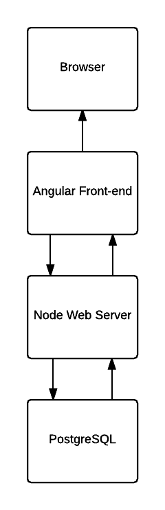
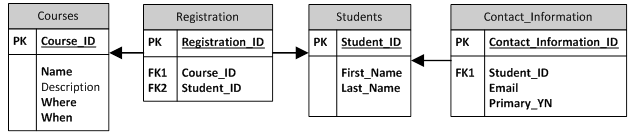
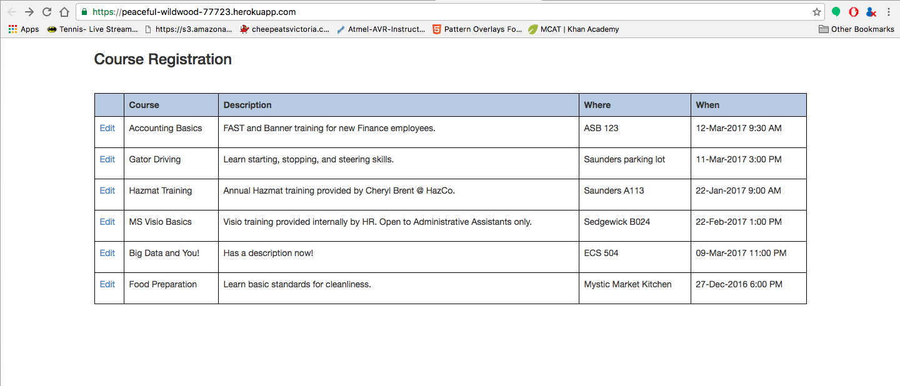
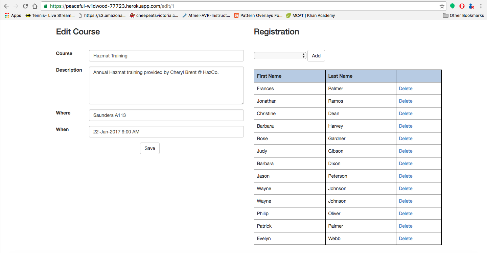

# uvicApp

### User Story
---
 - A user will select a course from a list of courses and the system will display, on a different screen, the details of the selected course.
 - The user should be able to make changes to the course details (course name, description, where or when).
 - A user will be able to add a student to the course by selecting from a drop-down box (not self-service for the student).
 - A user will be able to remove a student from a course.
 - When a user is happy with the changes to a course they can click Save and the data will be saved.

### Architecture
---
uvicApp is a simple registration app built using node.js and angular.js with a postgresql database. The architecture is as follows:

The ER diagram for the database is here:

### Deployment
---
uvicApp is deployed on heroku at:
https://peaceful-wildwood-77723.herokuapp.com/
### Setup
---
You must have the following installed:
 - node version 5.8.0+
 - npm version 3.7.3+

To run locally:
 - Download the code or clone the repository
 - Navigate to the app directory
 - Run 'sudo npm install' to install all of the dependencies
 - Run 'node server.js' to start the server
 - Open a web browser and navigate to http://localhost:3000

### Screenshots
Course registration screen:

Edit course screen:

